# Manual

---

## NOTAS

- **No atender** los que digan ASA...
- **No atender** GRUPO GRAN VÍA (MEIGAS)
- En caso de no poder abrir servicios, iniciarlos desde el administrador de tareas (clic derecho en barra de tareas):

### Servicios a iniciar manualmente

1. **SGCVSVC:** Monitor de controles volumétricos  
   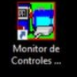

2. **SGERSVC:** Monitor de envío y recepción de información  
   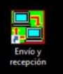

3. **SGPMSVC:** Monitor de bombas  
   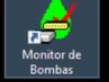

4. **SGPSSVC:** Servidor de impresión  
   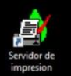

5. **SGTMSVC:** Monitor de tanque  
   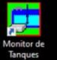

---

### Rutas

- Ruta donde se guardan los accesos de los servicios:  
  `C:/Program Files (x86)/Atio/ControlGAS`

- Ruta donde se guardan los archivos de los servicios:  
  `C:/Program Files/Atio/ControlGAS/Carpeta de monitor`

---

## CgMonitor

Pasos para levantar **Atio Update, Envol Supervisor, FG IP Sender, Watch Dog Atio Loader**:

1. Ingresar a *Servicios*.
2. Buscar los servicios correspondientes.
3. Clic derecho sobre el servicio.
4. Dirigirse a la pestaña de **Recuperación**.  
   
5. Seleccionar **Reiniciar servicios** en los 3 apartados, poner:
   - Días: `0`
   - Minutos: `1`  
   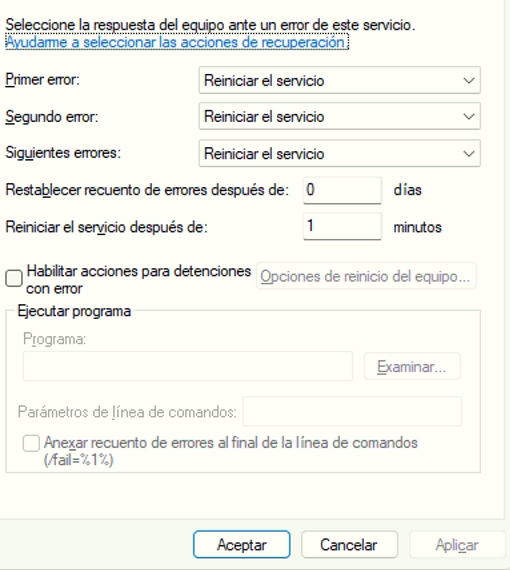
6. Revisar que **Atio Loader** se esté ejecutando.
7. Por último, reiniciar **CgMonitor** desde el apartado de *Servicios*.

---

## Cloud

1. Ingresar a proceso o **Commvault**.  
   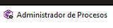
2. Verificar que el host y el servidor sean correctos.  
   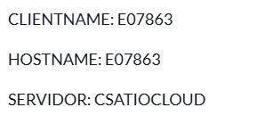
3. Dirigirse a *Servicios*.  
   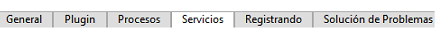
4. Detener los 3 servicios.
5. Iniciar los 3 servicios.  
   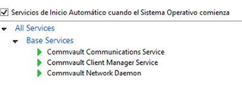
6. Si no permite iniciarlos, ir a servicios, buscar **Commvault** y habilitarlos (poner en automático).

---

## SGCVSVC, SGERSVC, SGPMSVC, SGPSSVC, SGTMSVC

Pasos para levantar estos servicios:

1. Verificar que estén abiertos.
2. Iniciar los servicios desde el escritorio.

---

## SQL

### Revisar

- SQL Server Browser
- MSSQLSERVER

### Cuando el número de cliente y el host están mal:

1. Desinstalar la aplicación de **Commvault**.
2. Seleccionar que desinstale todos los paquetes de la instancia.
3. Instalar nuevamente desde la carpeta con todos los instaladores.
4. Colocar el número de cliente y el host correctos.
5. Proceder con la instalación.

---

### Instaladores

Ruta:  
`C:/Archivos de programa/Atio/ControlGAS/Herramientas`

Ahí se encuentran los instaladores.
## WinScp
   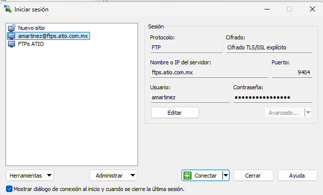

---

## Instalar CgMonitor

1. ir a la carpeta de control gas
2. abrir el uk y en tipo debe de decir maestra
3. copiamos el .zip en descargas
4. iniciamos la instalacion
5. seleccionamos perfil 4
6. seleccionamos los que ocupe la estacion
7. abrimos el log que se creo y mandamos pruebas el grupo de cgmonitor y esperamos validacion
   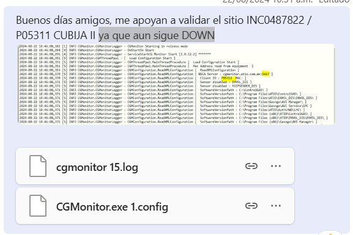

Seleccionar los que aparezcan en el portal.

---

## FreeSpached

### Limpieza de espacio

1. Ir a:  
   `C:/Archivos de programa/Microsoft SQL Server/MSSQLSERVER/MSSQL/DATA` o `Backup`
2. Abrir el **Liberador de espacio en disco** de Windows.
3. Seleccionar todo y aceptar.

---

### Borrar archivos temporales

Ruta: `%temp%`  
Seleccionar todo y borrar.

---

### Borrar log de SQL

Pasos:

1. Abrir SQL Server.
2. Ir a "Ventanas" y buscar el nombre de la base de datos.
3. Presionar **New Query**.
4. Ingresar el script (reemplazando el nombre de la base).
5. Seleccionar la base `master`, cambiarla por la correspondiente.
6. Ejecutar.
7. Repetir para la base **featio**.

#### Script

```sql
USE [P04073];
GO
-- Truncate the log by changing the database recovery model to SIMPLE.
ALTER DATABASE [P04073]
SET RECOVERY SIMPLE;
GO
-- Shrink the truncated log file to 1 MB.
-- backup database [P04073] to disk = 'C:\ControlGAS\Herramientas\BD\Los Santos_280409.bak' with init

DBCC SHRINKDATABASE ([P04073], TRUNCATEONLY )
GO
-- Reset the database recovery model.
ALTER DATABASE [P04073]
SET RECOVERY FULL;
GO
